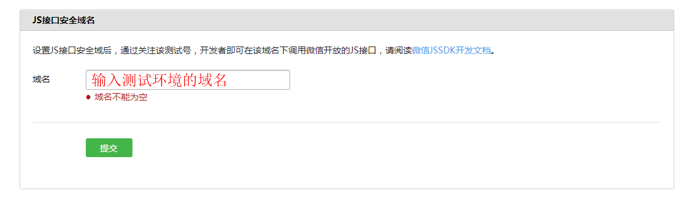

# 微信公众号JS-SDK接口测试服务

### 1. 微信公众账号测试号申请

[https://developers.weixin.qq.com/doc/offiaccount/Basic_Information/Requesting_an_API_Test_Account.html](https://developers.weixin.qq.com/doc/offiaccount/Basic_Information/Requesting_an_API_Test_Account.html)

### 2. 更改配置信息

修改配置文件：`${root}/conf/weixin.json`

``` json
{
  "APP_ID": "公众号appID",
  "APP_SECRET": "公众号appsecret",
  "request_url": "获取jssdk配置的动态接口地址"
}
```

### 3. 安全域名配置



### 4. 服务配置

由于微信安全域名的限制，需保证前端项目与本服务放置在同一域名的服务下。
